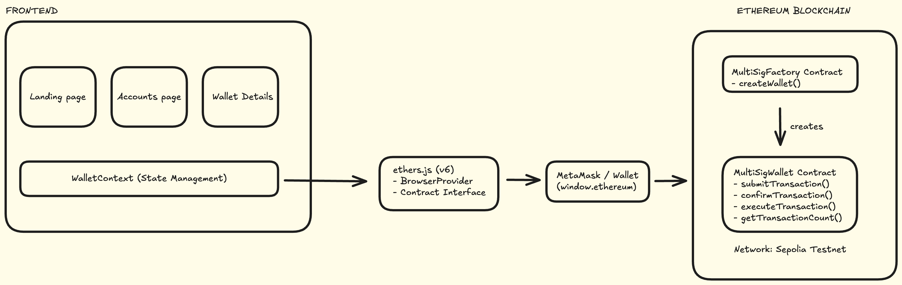

# CoSign

**Multi-signature wallet for Ethereum. Require multiple approvals before executing transactions.**

[](https://soliditylang.org/)
[](https://nextjs.org/)
[](https://www.typescriptlang.org/)

---

## The Problem

Traditional single-key wallets create critical vulnerabilities:

- **Single point of failure** - One compromised private key = total fund loss
- **No accountability** - Any keyholder can drain funds without oversight
- **Insider risk** - Teams must trust one person with treasury access
- **No recovery** - Lost key = permanently lost funds

DAOs, startups, and teams managing shared treasuries face impossible choices: centralize control (risky) or distribute keys without safeguards (riskier).

---

## The Solution

CoSign implements **M-of-N multisig** where transactions require multiple approvals before execution. No single person can move funds alone.

**Why CoSign?**

- **Trustless execution** - Smart contracts enforce approval rules, not people
- **Fully on-chain** - All data stored on Ethereum, no centralized backend
- **Flexible thresholds** - Configure 2-of-3, 3-of-5, or any M-of-N combination
- **Factory pattern** - Deploy unlimited wallets with different owners/thresholds
- **Built for teams** - DAOs, startups, shared custody, personal security

Once ETH enters a CoSign wallet, **no individual owner controls it**. Only collective approval can execute transactions.

---

## Architecture



**System Flow:**

```
User → Frontend (Next.js) → ethers.js → MetaMask
                                ↓
                    MultisigFactory.sol (deploys)
                                ↓
                    MultisigWallet.sol (executes)
                                ↓
                         Ethereum Network
```

**Smart Contracts:**

- **MultisigFactory** - Deploys new multisig wallets, tracks ownership
- **MultisigWallet** - Manages transactions, approvals, and execution

**Frontend:**

- Next.js 15 (App Router) + TypeScript
- ethers.js v6 for blockchain interaction
- Real-time wallet/transaction state management

---

## Transaction Lifecycle

### 1. Wallet Creation

**User Action:** Connect wallet → Create account → Define owners + threshold

**On-Chain:**
```solidity
MultisigFactory.createMultisig(owners[], threshold)
  → Deploys new MultisigWallet instance
  → Emits MultisigCreated(walletAddress, owners, threshold)
```

**Result:** New multisig wallet address stored in factory registry

---

### 2. Transaction Proposal

**User Action:** Submit transaction with recipient address and ETH amount

**On-Chain:**
```solidity
MultisigWallet.submitTransaction(to, value, data)
  → Creates transaction with ID
  → Stores: destination, amount, data, status = pending
  → Auto-approves from submitter
```

**Result:** Transaction awaits additional approvals (1 of N collected)

---

### 3. Approval Collection

**User Action:** Other owners review and approve the transaction

**On-Chain:**
```solidity
MultisigWallet.approveTransaction(txId)
  → Checks: msg.sender is owner
  → Prevents: duplicate approvals
  → Increments approval count
```

**Result:** Approval count increases (e.g., 2 of 3, 3 of 5)

---

### 4. Execution

**User Action:** Any owner triggers execution once threshold is met

**On-Chain:**
```solidity
MultisigWallet.executeTransaction(txId)
  → Validates: approvals >= threshold
  → Marks: status = executed
  → Transfers: ETH to recipient (with reentrancy protection)
  → Prevents: double execution
```

**Result:** Funds transferred, transaction marked executed permanently

---

## Security Design

### Why These Patterns?

**1. Reentrancy Guard**
- **Risk:** Malicious contracts calling back during execution
- **Protection:** OpenZeppelin ReentrancyGuard on `executeTransaction()`
- **Result:** Execution completes atomically, no reentry possible

**2. Threshold Validation**
- **Risk:** Executing with insufficient approvals
- **Protection:** Require `approvals >= threshold` before execution
- **Result:** Enforces M-of-N rule at contract level

**3. Owner-Only Submission**
- **Risk:** External actors creating spam transactions
- **Protection:** `onlyOwner` modifier on `submitTransaction()`
- **Result:** Only authorized owners can propose

**4. No Duplicate Approvals**
- **Risk:** One owner approving multiple times to meet threshold
- **Protection:** Mapping tracks approvals per owner per transaction
- **Result:** Each owner approves once maximum

**5. Execute Once**
- **Risk:** Re-executing completed transactions
- **Protection:** Boolean flag `executed` + status check
- **Result:** Transaction executes exactly once

**6. No Proxy/Upgradeable Pattern**
- **Design Choice:** Immutable contracts for maximum trust
- **Trade-off:** No upgrades, but no hidden backdoors
- **Result:** What you audit is what runs forever

---

## Local Setup

### Prerequisites

- Node.js 18+
- MetaMask browser extension
- Git

### Installation

```bash
# Clone repository
git clone https://github.com/yourusername/cosign.git
cd cosign

# Install contract dependencies
cd contracts
npm install

# Install frontend dependencies
cd ../frontend
npm install
```

### Running Locally

**Terminal 1 - Start local blockchain:**
```bash
cd contracts
npx hardhat node
```

**Terminal 2 - Deploy contracts:**
```bash
cd contracts
npx hardhat run scripts/deploy.ts --network localhost
```

Copy the deployed `MultisigFactory` address to `frontend/lib/addresses.ts`:

```typescript
export const FACTORY_ADDRESS = "0x5FbDB2315678afecb367f032d93F642f64180aa3";
```

**Terminal 3 - Start frontend:**
```bash
cd frontend
npm run dev
```

### Connect MetaMask

1. Open MetaMask
2. Add Network:
   - Network Name: `Localhost`
   - RPC URL: `http://127.0.0.1:8545`
   - Chain ID: `31337`
   - Currency: `ETH`
3. Import test account from Hardhat node output
4. Visit `http://localhost:3000`

---

## Tech Stack

**Smart Contracts:**
- Solidity 0.8.27
- Hardhat development environment
- OpenZeppelin contracts (ReentrancyGuard)
- ethers.js for deployment scripts

**Frontend:**
- Next.js 15 (App Router)
- TypeScript 5
- Tailwind CSS + custom dark theme
- ethers.js v6
- Vercel Analytics

**Network Support:**
- Localhost (31337) - Development
- Sepolia (11155111) - Testnet

---

## Project Structure

```
cosign/
├── contracts/
│   ├── contracts/
│   │   ├── MultisigFactory.sol
│   │   └── MultisigWallet.sol
│   ├── scripts/deploy.ts
│   ├── test/
│   └── hardhat.config.ts
├── frontend/
│   ├── app/               # Next.js pages
│   ├── components/        # React components
│   ├── lib/
│   │   ├── abis/          # Contract ABIs
│   │   ├── wallet-context.tsx
│   │   └── addresses.ts
│   └── public/
└── README.md
```

---


## Use Cases

- **DAO Treasuries** - Require board approval before spending
- **Startup Funds** - Co-founders share custody of company ETH
- **Personal Security** - Split keys across devices/locations
- **Joint Accounts** - Shared control for partners/teams
- **Escrow Services** - Buyer + seller + arbiter = 2-of-3

---

**Built for the decentralized future.**
